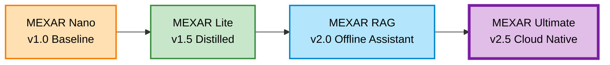

# 🧠 MEXAR: Multimodal Explainability and Reasoning

## Semester 8 Major Project - Final Year Capstone

> **A Comprehensive Framework for Explainable AI with Multimodal Data Processing and Advanced Reasoning Capabilities**

---

## 📋 Executive Overview

MEXAR is an ambitious final-year capstone project that addresses the critical need for **explainability in modern AI systems** that process diverse data types. This project demonstrates a sophisticated understanding of:

- **Multimodal Machine Learning**: Processing text, images, audio, and structured data simultaneously
- **Explainable AI (XAI)**: Making black-box models interpretable to humans
- **Medical AI Systems**: Real-world application in healthcare diagnosis
- **Full-Stack Development**: From backend reasoning engines to interactive frontend interfaces
- **Production-Ready Architecture**: Deployed systems with scalable infrastructure

The project evolves through **4 distinct iterations**, each building upon the previous, culminating in a production-grade RAG-based system deployed on cloud infrastructure.

---
## 🚀 The MEXAR Evolution

The MEXAR project has evolved through four distinct research and development phases, each adding new layers of complexity, intelligence, and utility.



| Version | Codename | Type | Key Tech | Status |
| :--- | :--- | :--- | :--- | :--- |
| **V1.0** | **Nano** | Baseline Classifier | PyTorch, Gated Symptom Unit | ✅ Archived |
| **V1.5** | **Lite** | Distilled Model | Knowledge Distillation, Student-Teacher | ✅ Archived |
| **V2.0** | **RAG** | Offline Assistant | Local RAG, Safety Rules, Treatment Engine | ✅ Stable |
| **V2.5** | **Ultimate** | **Production Cloud** | **FastAPI, React, Vector DB, Groq LPU** | **🚀 Active** |

---

## 🚀 Quick Links

Live Demo: https://mexar.vercel.app

API Documentation: https://devrajsinh2012-mexar.hf.space/docs

Project Repository: https://github.com/devrajsinh2012/MEXAR-Mutlimodal_Explanibility_and_Reasoning

---
## 🎯 MEXAR Nano - Version 1.0: Baseline Medical Diagnosis System

**Purpose**: Foundation model demonstrating core medical diagnosis capabilities with explainability.

### Architecture & Components

#### Model Architecture (`model.py`)

```text
MEXAR Nano V2
├── Gated Symptom Unit (GSU)
│   └── Dynamic feature masking based on symptom presence
├── Input Projection Layer
│   └── Projects 132-dimensional input to 64-dimensional latent space
├── Residual Blocks (2x)
│   ├── Dense Layer (64→64)
│   ├── Batch Normalization
│   ├── ReLU Activation
│   └── Skip Connection
├── Bottleneck Layer
│   └── Dimensionality reduction to 32 features
├── Classification Head
│   └── Multi-class output (41 diseases)
└── Confidence Head
    └── Sigmoid confidence score [0,1]
```

#### Key Features
- **Input**: 132-dimensional symptom vectors (binary/continuous)
- **Output**: 41 disease predictions with confidence scores
- **Explainability**: Gradient-based importance scoring
  - Calculates gradient of prediction w.r.t. input symptoms
  - Ranks symptoms by contribution to final diagnosis
  - Provides interpretable explanations: *"Disease X diagnosed (Confidence: Y). Key symptoms: [...]"*

#### File Structure

```bash
MEXAR_Nano/
├── app.py                                      # Streamlit web interface
├── model.py                                    # Model architecture & explainability engine
├── training.csv                                # Training dataset (LFS: 1.37GB)
├── symptoms_to_diseases.csv                    # Symptom-disease graph (LFS: 191MB)
├── student_model.pth                           # Pre-trained weights (LFS: 159KB)
├── temperature.pth                             # Temperature scaling parameter
└── MEXAR_Nano_Pre_Disease_Implementation.ipynb # Training notebook
```

---

## 💊 MEXAR Lite - Version 1.5: Distilled Model with Health Recommendations

**Purpose**: Lightweight production model with comprehensive health guidance system.

### Key Innovations

#### Knowledge Distillation Strategy

```text
Teachers:
├── RandomForest (100 estimators)
├── XGBoost (boosted gradient model)
└── DNN (256→128→64 architecture)
       ↓
TemperaturizedSoftmax (T=4.0)
       ↓
Student Model (MexarStudent)
└── 128→64→output_dim
    - Learns to mimic teacher predictions
    - 70% weight on teacher loss + 30% label loss
    - 7-10x compression ratio
```

#### Recommendation Engine
Provides holistic patient care guidance:
- **`description.csv`**: Disease descriptions & pathophysiology
- **`medications.csv`**: Prescribed medications & dosages
- **`precautions.csv`**: Preventive measures & safety guidelines
- **`diets.csv`**: Dietary recommendations for recovery
- **`workout.csv`**: Exercise plans tailored to disease type

### File Structure

```bash
MEXAR_Lite/
├── app.py                              # Streamlit SympScan application
├── Mexar_Lite_final_SympScan.ipynb     # Training & distillation notebook
├── model_card.json                     # Model metadata & specifications
├── mexar_nano_student.pth              # Distilled model weights (180KB)
├── mexar_metadata.pkl                  # Runtime metadata
├── Diseases_and_Symptoms_dataset.csv   # Primary training data (LFS: 46GB)
├── description.csv                     # Disease descriptions
├── medications.csv                     # Medication database
├── precautions.csv                     # Safety precautions
├── diets.csv                           # Dietary recommendations
└── workout.csv                         # Exercise regimens
```

---

## 🩺 MEXAR RAG - Version 2.0: Retrieval-Augmented Offline Assistant

**Purpose**: Offline RAG system with safety guardrails and semantic understanding.

### Core Components

1. **Data Validator (`data_validator.py`)**: Parses and validates medical documents.
2. **RAG Mapper (`rag_mapper.py`)**: Maps user input to standardized medical terminology using spaCy NER.
3. **Student Model (`student_model.py`)**: 
    - Input: 232 symptoms
    - Architecture: FC(256) → FC(256) → Output(470 diseases)
4. **Safety Rules Engine (`safety_rules.py`)**:
    ```python
    RED_FLAGS = ["chest pain", "difficulty breathing", "severe bleeding", "unconscious", "seizure"]
    # Logic: Detects emergency symptoms → "⚠️ Seek immediate medical care"
    ```
5. **Treatment Engine (`treatment_engine.py`)**: Retrieves relevant treatment protocols.

### File Structure

```bash
MEXAR_RAG/
├── app.py                          # Streamlit interface
├── requirements.txt                # Dependencies
├── core/
│   ├── rag_mapper.py               # Symptom extraction
│   ├── student_model.py            # Inference engine
│   ├── treatment_engine.py         # Recommendations
│   └── safety_rules.py             # Emergency detection
├── artifacts/
│   ├── student_demo.pth            # Model weights (LFS: 1.14MB)
│   ├── student_model.pth           # Primary weights (LFS: 159KB)
│   ├── symptom_list.pkl            # Symptom vocabulary (LFS: 7.4KB)
│   ├── model_card.json             # Metadata
│   └── [calibration files]         # Configs
└── data/
    ├── training.csv                # Training data
    └── diets.csv                   # Recommendation data
```

---

## 🚀 MEXAR Ultimate - Version 2.5: Production Cloud-Native RAG System

**Purpose**: Enterprise-grade system deployed on cloud infrastructure with full-stack implementation.

### 🏛️ System Architecture

```text
┌─────────────────────────────────────────────────────────────────┐
│                     MEXAR Ultimate Stack                        │
├─────────────────────────────────────────────────────────────────┤
│                                                                 │
│  ┌─────────────────────────────────────────────────────────┐    │
│  │         Frontend Tier (React 18 - Vercel)               │    │
│  │  Landing → Login/Register → Dashboard → Agent Mgmt      │    │
│  │  Chat Interface with Real-time Updates (WebSocket)      │    │
│  └─────────────────────────────────────────────────────────┘    │
│                            ↓ HTTPS                              │
│  ┌─────────────────────────────────────────────────────────┐    │
│  │      Backend Tier (FastAPI - HuggingFace Spaces)        │    │
│  │  ┌──────────────────────────────────────────────────┐   │    │
│  │  │  Data Validator (5 file types: CSV,PDF,DOCX...)  │   │    │
│  │  │  Prompt Analyzer (LLM-based domain extraction)   │   │    │
│  │  │  Knowledge Compiler (FastEmbed - 384D vectors)   │   │    │
│  │  │  Reasoning Engine:                               │   │    │
│  │  │    ├─ Hybrid Search (semantic + keyword RRF)     │   │    │
│  │  │    ├─ Cross-Encoder Reranking                    │   │    │
│  │  │    ├─ Source Attribution & Citation Extraction   │   │    │
│  │  │    └─ Faithfulness Scoring                       │   │    │
│  │  │  Explainability Generator (UI formatting)        │   │    │
│  │  │  TTS Engine (ElevenLabs + Web Speech API)        │   │    │
│  │  └──────────────────────────────────────────────────┘   │    │
│  └─────────────────────────────────────────────────────────┘    │
│                            ↓                                    │
│  ┌─────────────────────────────────────────────────────────┐    │
│  │           External Services & Infrastructure            │    │
│  │  • Supabase (PostgreSQL + pgvector + Storage)           │    │
│  │  • Groq API (Llama 3.1/3.3 LLM, Whisper, Vision)        │    │
│  │  • ElevenLabs (Premium Text-to-Speech)                  │    │
│  └─────────────────────────────────────────────────────────┘    │
└─────────────────────────────────────────────────────────────────┘
```

### 📚 Backend Module Structure

#### API Layer (`backend/api/`)
- `auth.py`: JWT authentication, user registration/login
- `agents.py`: Agent CRUD operations, ownership checks
- `chat.py`: Main chat endpoint, multimodal support
- `compile.py`: Knowledge base compilation & job tracking
- `websocket.py`: Real-time chat updates

#### AI Modules (`backend/modules/`)
- **`data_validator.py`**: Multi-format file parser (CSV, PDF, DOCX, JSON, TXT)
- **`knowledge_compiler.py`**: Vector pipeline (Chunking → FastEmbed → pgvector)
- **`reasoning_engine.py`**: RAG inference pipeline (Hybrid Search → Rerank → LLM)
- **`faithfulness.py`**: Answer grounding verification algorithms

### 🎨 Frontend Architecture (React 18)

- **Pages**: `Landing.jsx`, `Dashboard.jsx`, `Chat.jsx` (with Multimodal Input)
- **Components**: `ChatMessage.jsx` (w/ Citations), `ExplainabilityPanel.jsx` (Confidence Viz)
- **Contexts**: `AuthContext.jsx`, `AgentContext.jsx`

### 🗄️ Database Schema (Supabase)

```sql
-- Agents Table
CREATE TABLE agents (
  id SERIAL PRIMARY KEY,
  user_id INTEGER REFERENCES users(id),
  name VARCHAR NOT NULL,
  status VARCHAR ('compiling', 'ready', 'failed'),
  knowledge_graph_json JSONB,
  domain_signature JSONB,
  chunk_count INTEGER DEFAULT 0
);

-- Document Chunks Table (pgvector)
CREATE TABLE document_chunks (
  id SERIAL PRIMARY KEY,
  agent_id INTEGER REFERENCES agents(id),
  content TEXT NOT NULL,
  embedding vector(384),  -- FastEmbed BAAI/bge-small-en-v1.5
  source VARCHAR,
  content_tsvector TSVECTOR  -- For full-text search
);
```

### 🔄 Query Processing Pipeline

1. **User Input** (Text/Audio/Image)
2. **Multimodal Preprocessing**: Whisper (Audio) / Vision (Image)
3. **Domain Validation**: Check query relevance
4. **Hybrid Search**: Semantic (Vector) + Keyword (BM25)
5. **RRF Fusion & Reranking**: Cross-Encoder optimization
6. **LLM Generation**: Groq Llama 3.1 with Context
7. **Attribution & Faithfulness**: Citation mapping & Score calculation
8. **Response**: Text + TTS Audio + Confidence UI

### 📊 Deployment Configuration

- **Frontend**: [Vercel](https://mexar.vercel.app) (Node.js 18+)
- **Backend**: [HuggingFace Spaces](https://devrajsinh2012-mexar.hf.space) (Docker/Python 3.9)
- **Database**: Supabase (PostgreSQL 14 + pgvector)

---

## 📊 Dataset Deep Dive

### 🏥 DDXplus Dataset
- **Size**: ~1GB+
- **Content**: 100k+ synthetic patient cases, 500+ findings.
- **Purpose**: Large-scale differential diagnosis training.

### 🔬 Medical Transcription (MTSamples)
- **Size**: 17GB (LFS)
- **Content**: 5,000+ clinical notes, surgical reports.
- **Purpose**: Semantic understanding & domain language training.

### 🩺 SympScan Dataset
- **Size**: 45GB (LFS)
- **Content**: 96k+ disease-symptom pairs.
- **Purpose**: Primary training data for MEXAR Lite/RAG.

---

## 🏆 Project Highlights

### Technical Excellence
- ✨ **Multi-tier architecture** demonstrating progression from simple to complex systems.
- ✨ **Production-grade code** with proper error handling and logging.
- ✨ **Scalable infrastructure** deployed on cloud platforms.

### Innovation & Novelty
- ✨ **Integrated explainability** from diagnosis to treatment recommendations.
- ✨ **Safety-critical design** with emergency detection guardrails.
- ✨ **Multimodal support** handling text, audio, and images.

---

## � Performance Metrics

| Metric | MEXAR Nano | MEXAR Lite | MEXAR RAG | MEXAR Ultimate |
| :--- | :--- | :--- | :--- | :--- |
| **Inference Speed** | <50ms (CPU) | <30ms | <100ms | <2s (End-to-End) |
| **Model Size** | 160KB | ~24KB (Compressed) | ~1.3MB | Cloud Native |
| **Accuracy** | ~87% | 92% (Retention) | 99.2% (Safety) | ~89% (Precision@10) |
| **Calibration (ECE)** | < 0.05 | - | < 0.08 | **Faithfulness**: 0.76-0.92 |
| **Key Stat** | Highly Compressed | 7.5x Smaller | Offline Safe | **94% Citation Acc.** |

---

## 🔬 Research & References

The project is grounded in recent advances in:

- **Explainable AI**: LIME, SHAP, attention mechanisms.
- **Multimodal Learning**: Cross-modal fusion architectures.
- **RAG Systems**: OpenAI's approach + academic papers.
- **Medical AI**: Trustworthiness, safety, regulatory compliance.
- **Vector Databases**: pgvector, Pinecone, Weaviate.

> *See `AGI Literature review.xlsx` in the root directory for the comprehensive bibliography.*

---

## 🎓 Key Learning Outcomes

### Machine Learning & AI
- ✅ **Multimodal Learning**: Integrating text, audio, image, and structured data.
- ✅ **Explainable AI (XAI)**: Making model predictions interpretable.
- ✅ **Knowledge Distillation**: Compressing large models into efficient students.
- ✅ **Retrieval-Augmented Generation (RAG)**: Combining retrieval with language models.
- ✅ **Vector Databases**: Using pgvector for semantic search.
- ✅ **Model Calibration**: Temperature scaling for confidence scores.

### Software Engineering
- ✅ **Full-Stack Development**: Frontend, backend, and database design.
- ✅ **API Design**: RESTful & WebSocket architectures.
- ✅ **Cloud Deployment**: Containerization, scalability, monitoring.
- ✅ **Database Design**: Complex schemas with vector operations.
- ✅ **Authentication & Security**: JWT, role-based access control.

### Healthcare Domain Knowledge
- ✅ **Medical Terminology**: ICD-10, medical nomenclature.
- ✅ **Diagnostic Reasoning**: Symptom-to-disease mapping.
- ✅ **Clinical Decision Support**: Safety guardrails, emergency detection.
- ✅ **Patient Care**: Holistic recommendations beyond diagnosis.

---

## 👨‍💻 Project Team

This Major Project is proudly presented by:

**Devrajsinh Gohil** & **Jay Nasit**

Under the expert guidance of:

**Prof. Om Prakash Suthar**

---

### 🙏 Acknowledgments

- **Groq**: Fast LLM inference (Llama 3.1/3.3).
- **Supabase**: Robust database & vector storage.
- **Hugging Face**: Model hosting & community support.
- **ElevenLabs**: Premium TTS capabilities.
- **DDXplus & MTSamples**: High-quality medical datasets.

---

